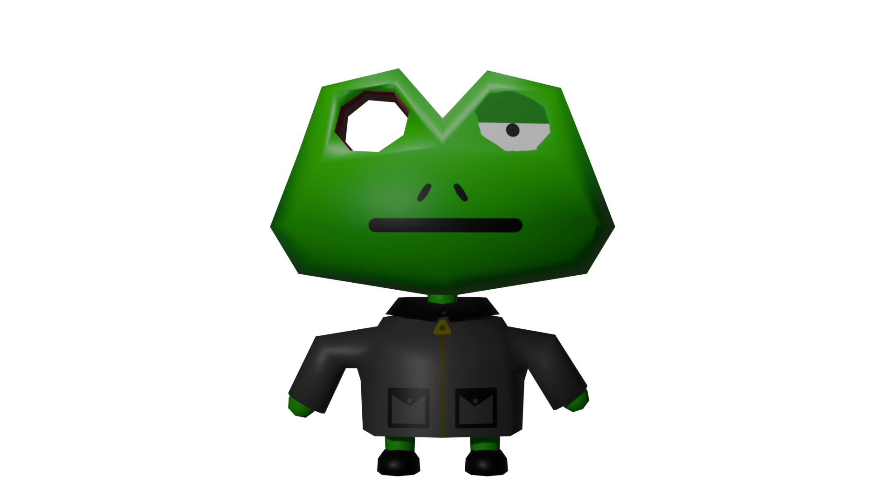
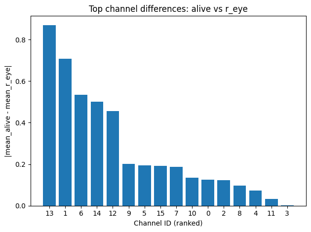
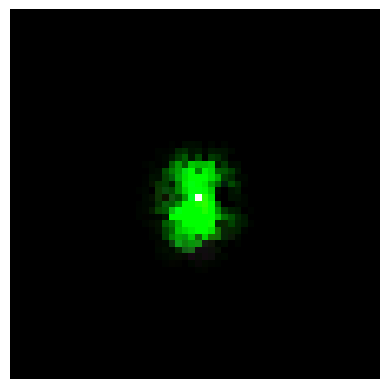

*While hot on the trail of an armed suspect, Mouse and Froggy suddenly find
themselves in the midst of an eery dark forest. Thick fog surrounds them and
it's hard to tell where they're going. They pause to catch their breath and
assess their surroundings. Just as everything comes to a strange quiet,
**BAM**, a loud gunshot is heard, and Froggy falls clutching his eye. His right
eye has been shot completely off!*

A graphic recreation of the event is shown below. Viewer discretion advised.

<video autoplay loop muted playsinline class="pixelated">
  <source src="/fixing-froggy1/frog_killEye.mp4" type="video/mp4">
</video>

## Recap

In my [last post](https://ukefat.github.io/blog/understanding-growing-nca/), I
recreated the model presented by Distill in [Growing Neural Cellular
Automata](https://distill.pub/2020/growing-ca/). I am going to be using the
same model in this post (the non-regenerating model as shown above) and am
assuming readers have a basic understanding of it going forward. In this post,
instead of just getting a model to work, I'd like to investigate a little bit
more on "how it works" or at least enough to try and fix Froggy's eye.

## Philosophical interlude on explainability

I originally wanted to make a post that could sort of explain how the NCA
actually grows to make its target image. As soon as I finished creating the
model and went to try and answer this question I immediately realized I had
given myself a pretty difficult task. I guess I had kept thinking about a
Richard Feynman quote I vaguely remembered, something like "If you can make it,
then you understand it". I suppose at the back of my head I was assuming if I
just made a model that worked then I would surely be able to explain it
afterwards.

I realize now this was very misguided. If you gave me two consenting adults and
about 9 months of time, I could create a human baby, but this doesn't mean I'd
understand much at all of how this baby works or the mechanisms governing its
development. Otherwise, everyone could pretty easily gain the title of
biomedical engineer.

If you actually know the Richard Feynman quote, it is actually "What I cannot
create, I do not understand" instead of "What I create -> I understand."
According to the actual quote, creating something is only a necessary condition
but not a sufficient condition in order to understand something. Okay then,
well since I created the system already, what are the other conditions
necessary for me to understand it?

Answering this question is also opening up another other can of worms. If we
want to understand the NCA system, at what point can we say that we understand
it? What are the necessary conditions to understand something?

<video autoplay loop muted playsinline>
  <source src="/fixing-froggy1/frog_eye_hole_cinematic.mp4" type="video/mp4">
</video>

### We need to be able to predict the system to understand it

If I am able to successfully predict what the NCA system will do when I disturb
it, that sounds like I understand it! I know that if I poke a hole in this
pixel, it will regenerate or not. However, I could theoretically run the
simulation for every single input state and make a massive lookup table for
every output state. I would be able to perfectly predict anything, but it
doesn't seem like I'd understand *why* any specific behaviour occurs. It seems
like prediction isn't sufficient.

### We need to know the mechanisms that produce the system to understand it

If we require more than simple prediction, maybe we need to understand the
exact mechanisms or processes that give us the observed outputs. I would
understand the system by observing that channel 5 tracks edges, channel 6
tracks "eye-ness", and so on. However, this method seems to only work for
simple systems like a bicycle as it's not clear with NCA if there are clean
separable modules understandable by humans. At the end of the day, the
mechanism can be reduced down to just matrix multiplication, but how helpful is
that? When I ask the doctor what's wrong with Froggy and he just tells me that
Froggy's weights are being multiplied, I wouldn't find that very helpful.
Reduction to simplest mechanisms is not always helpful and it's unclear if high
dimensional systems like our NCA can be decomposed into clean mechanisms at a
level that is understandable to us.

### We need to compress the system to understand it

If we take the information theory approach, if we can compress the complex
behaviour to a simple rule, then surely we must understand what's going on.
Like Conway's game of life, it looks chaotic and confusing, but if you find the
3-line rule, it all becomes clear what's going on. However, in our case, we
technically already have the update rule defined ourself. In fact, the model
fits nicely in about 40 KiB. Compressing everything about the system to just
40KiB sounds good and maybe makes a lot of sense to our computer, but is opaque
to us humans.

### If I can intervene on the system then I understand it

If I can make the system do whatever I want it to do, then surely I must
understand it. If my Froggy is missing an eye and I know how to make him regrow
an eye, then I must understand Froggy quite well to do that. However, this is
back to our baby example. Just because I can play romantic music on a Bluetooth
speaker, place rose petals on the bed, and then wait 9 months, doesn't mean I
understand how embryogenesis and morphogenesis work. Control doesn't guarantee
conceptual clarity.

### Okay maybe understanding means that we ne-

> FROGGY: PLEASE SOMEBODY JUST HELP ME! MY RIGHT EYE IS GONE!!!

Oh no... We've been navel-gazing for too long, we actually need to save Froggy.
I guess we'll just need to take the pragmatic approach and define understanding
Froggy as whatever will let us grow his eye back for now.

Hopefully you appreciate more now that trying to understand our NCA system
seems less like Newtonian Mechanics and more like doing actual medicine. With
all the many contributing factors, it's interesting trying to find some causal
expl-

> FROGGY: AAHHHHHHHHHHHH MY EYE!!!!!!!!!

Oops... let's get to work! See the [parable of the poisoned
arrow](https://www.dhammatalks.org/suttas/MN/MN63.html) for more info.

## Saving Froggy's Eye

We are going to run through some treatment options to see if we can fix
Froggy's eye and *maybe* we'll gain some understanding along the way. We are
going to start with the easiest solutions and then move down to the trickier
ones.

We'll try:
- constraining Froggy's growth
- using Froggy's clone eyeball from the freezer
- giving Froggy a mechanical eye
- chemical injection

### Constraining Froggy's growth

First of all, my main concern for Froggy is that when his eyes gets taken out,
his cells don't know what to do and they just start growing non-stop without
the eye. We didn't train the Froggy model to make scars, only to reach the
target image and stay there. 

*Note: In the future, it might be interesting to train a model to do things like
create scar tissue or make it harder for cells to just grow nonstop to make it
more realistic. We are going to focus on our simpler model for now though.*

If we let cells the keep growing, we have tumor growth and what we typically
consider to be Froggy falls apart, so we need to stop that. We can try fixing
this by giving him some metabolic inhibitors. We model this by reducing the
change between each step by a factor of 0.1.

<video autoplay loop muted playsinline class="pixelated">
  <source src="/fixing-froggy1/inhibited_growth.mp4" type="video/mp4">
</video>

We can see that maybe this helps Froggy stay okay a little longer, but the end
result is ultimately the same. What if instead we just prune excess growth a
certain radius around him. This will also hopefully make things a little more
realistic because cells would unlikely be able to sustain themselves with this
much growth and would die anyways.

<video autoplay loop muted playsinline class="pixelated">
  <source src="/fixing-froggy1/pruned.mp4" type="video/mp4">
</video>

Okay it seems like Froggy is at least contained now and his body doesn't have
to support endless growth. However, he is still missing an eye. Regardless, we
are going to keep this pruning method going forward because it is simple and
reduces excess growth.

### Giving Froggy a mechanical eye

What if we manufacture an artificial eyeball in the lab. It is the same shape
and has value 0.0 in all colours channels and its alpha is set to 0 because it
is technically dead/inert. We don't let the model updates this mechanical eye
because it is not alive. Let's see if Froggy's body accepts this new artificial
implant.

<video autoplay loop muted playsinline class="pixelated">
  <source src="/fixing-froggy1/fake_eye.mp4" type="video/mp4">
</video>

Looks like it works quite well, although the face is deformed a little bit as
the cells haven't been trained on this specific scenario so they are a little
bit unsure on how to act. This is a good solution regardless.

### Giving Froggy a natural eye

What if the agency secretly clones all of their agents and keeps their copies
in a freezer somewhere? This would be very useful! We'll just take an eyeball
from the clone and put it in. We implement this by simply saving the state of
the healthy eye of Froggy from earlier and inserting it later after his eye was
taken away.

<video autoplay loop muted playsinline class="pixelated">
  <source src="/fixing-froggy1/natural_eye.mp4" type="video/mp4">
</video>

This is even better than the mechanical implant, in fact it looks like Froggy
returns to normal as if nothing ever happened. This is probably the best
solution we have, assuming we have a perfect clone of Froggy...

### Chemical Injections

All of the previous methods required us to be quite lucky. We either needed to
have a mechanical eyeball on hand or a clone of a real one, which might not
always be the case. What if we could just trigger the growth of an eye? Surely
it must be possible since the cells had to create the eye in the first place
(albeit potentially from a different location in state space). What are some
minimal ways we could try to induce this change? We are going to imagine each
channel to be like a different chemical substance in a living body. Different
amounts of these substances may affect the behaviour of the organism. Now we
actually have to try to understand a little bit more what roles the different
channels/substances take part in so that we can potentially encourage them to
grow us a new eye. Before we do any of that, we are going to need to gather
some data.

#### Gathering cell data

Alright, I'm not a biologist and I don't know what I'm doing, so let's just
gather data on the two things I remember from my single statistics class: the
mean and the variance!

Below, we are just graphing the mean and variances for each channel depending
on the specific body part, like the eye or tongue or just all the alive cells.
What is considered an eye vs a tongue is a bit arbitrary here. I purposefully
designed Froggy so that each body part had a distinct pattern in RGB space. The
RGB codes are as follows: eyes are 000 in RGB, body is 010, and the tongue is
101 (assuming RGB values are scaled to 0-1). I classify body parts if each RGB
value is 0.1 units away or less from one of the specified codes. So for
example, if RGB values are (0.05, 0.93, 0.02), then I consider that to be part
of the body. 

The following data was taken from a normal growing Froggy.

That's a lot of data and plotted poorly (I ran out of colours for each
channel...). However, just by taking a quick look we can see how different body
parts each have different chemical signatures. We also see that there is an
initial growth period which then stabilizes into our Froggy after about 100-150
steps.

We can also take a look at which channels are activating in which areas.
Perhaps by viewing activation maps for each of the 16 channels (I label them
0-15), we can see see if certain channels are responsible for specific
aspects of the image.

<video autoplay loop muted playsinline class="pixelated">
  <source src="/fixing-froggy1/tiled_channels_growth.mp4" type="video/mp4">
</video>

As we can see, there is no specific channel for edges, or another channel for
eyeballs, or another channel for axis (besides the RGBA channels at the top,
but that shouldn't be surprising because our model was tested against those 4
channels). It looks like channel 5, 10, and 13 could be specifying the edges of
the image, but otherwise all the channels don't appear to have one clearly
defined role.

We can check this out by ablating each channel. We can take each channel and
for every step, force that specific channel to remain 0 for all time and see
how the dynamics change.

<video autoplay loop muted playsinline class="pixelated">
  <source src="/fixing-froggy1/all_ablations.mp4" type="video/mp4">
</video>

As you can see, just because 5, 10, and 13 look like they might be
controlling boundaries, we can ablate some other channel besides those 3,
and the image can still spread out uncontrollably. 

Some channels seem more important than others, as Froggy is still able to
mostly hang together in some cases, so it's unclear what those channels are
doing if not much changes otherwise, like channel 8 for example.

Anyways, I am getting overwhelmed with all this data. I see Froggy giving me
the side eye (not that he can currently do much else at the moment), signaling
that we are thinking too much and just need to just fix his eye.

#### What to do with this data?

Now that we have an idea of the different channel levels for different parts of
a healthy Froggy, how can we use it to trigger the growth of an eye?

I propose we just compare what channels are most different between the right
eye and the rest of the body. Maybe the channels that are most different from
the rest of the body encode a certain amount of "eye-ness". Therefore, we would
just need to alter those channels.

We can graph the difference in mean between all of the alive cells and the
right eye.

We can see that channel 13 is the most different. Channel 1 is next, which is
unsurprising as most of Froggy has green channel set to 1, but the eyes are
black. Channel 3 is unsurprisingly the least different because this is the
aliveness channel and both eyes and the body should all be alive.

We can look at how the 5 most different channels are activated all over Froggy
below.

Since channel 13 seems to be the biggest differentiator between the eye and the
body, let's just try injecting some substance 13 into the area around Froggy's
eye.

#### Injecting substance 13

I looked at the approximate value for Froggy's right eye, which is about -1.0
and I set this channel in the right eye area to -1 for 100 steps to see if this
would cause an eye to regrow back.

<video autoplay loop muted playsinline class="pixelated">
  <source src="/fixing-froggy1/inject_ch13.mp4" type="video/mp4">
</video>

As we can see, it looked like it helped to start growing an eye, but it doesn't
look particularly healthy or stable. I repeated this process for the 5 most
different channels above and none of them were able to grow an eye on their
own, except for channel 1. Injecting to channel 1 (Green channel) is pretty
close to just hardcoding the output to be what we want, so for that reason I'm
not counting it. In my view the RGBA channels are essentially the phenotype,
and I don't want to just directly change the phenotype but rather figure out
how we can change the other invisible systems that influence the phenotype.
Therefore, next we are going to do the same thing, but with a concoction of the
top 5 different channels (minus channel 1).

#### Injecting eyeball concoction

<video autoplay loop muted playsinline class="pixelated">
  <source src="/fixing-froggy1/inject_concoction.mp4" type="video/mp4">
</video>

Even with the concoction, it is only mildly more effective than just injecting
into channel 13. I tried a few runs and actually saw a couple that formed more
closely to an eye, but what you see above tended to be the most common result.
It seems this method isn't proving to be particularly effective.

#### Last attempt - embryo environment recreation

Okay, I think I have one more idea left before Froggy is just going to have
figure this out himself. Frogs typically aren't able to regrow limbs, but [in
2022 some scientists from Harvard were able to get a frog to do just
that](https://wyss.harvard.edu/news/achieving-a-milestone-scientists-regrow-frogs-lost-leg/). 

They used some cap on the stub of the frog's missing limb, which supposedly
activated molecular pathways that were typically only present during embryo
development, which allowed the cells to trigger this growing process again.

What if we do something similar for Froggy? We can once again find the mean
values of each channel during early development, like step 15 where nothing has
really finished growing yet.

If we set the channels in the eye area to approximately these values, maybe we
will trigger some growth process that will cause our eye to be rebuilt?

<video autoplay loop muted playsinline class="pixelated">
  <source src="/fixing-froggy1/inject_growth_channels.mp4" type="video/mp4">
</video>

Unfortunately, this is not the case, and seems worse off than our other
attempts as well as looking a little violent.

## Conclusion

It looks like as long as we have some spare eyeballs lying around, we should be
able to get Froggy up and running; however, if this is not the case, it looks a
little bit more difficult to achieve similar results. We tried to see if
slightly perturbing a channel or two could also lead to the rebuilding of an
eye, but so far no luck. To be honest, I wasn't handling all of this data and
applying channels weights with a lot of rigor or class, so maybe better results
could be found, but maybe I was getting tired of trying to fix my fictional
Frog creature. Especially when I know I have another one saved that I actually
trained to regrow his eyeball so we don't even have to worry about problems
like this.

<video autoplay loop muted playsinline class="pixelated">
  <source src="/fixing-froggy1/regrowing_froggy.mp4" type="video/mp4">
</video>

At the end of the day, we didn't do a whole lot of serious science here. Mostly
just trying random ideas and qualitatively measuring how effective they are. We
were essentially doing some alchemy. We didn't really have any measure to
quantify how well our methods worked or predict very well the outcomes of our
different experiments. Maybe through some more formalizing we'd be able to come
up with some better ways to regrow an eye. I'd like to dig more into this, but
I think that should be handled in a new post!

I think NCA are a very interesting system and worth exploring some more. We are
able to train them to do certain actions without knowing exactly what methods
are being employed under the hood, making an interesting parallel to actual
biology. Ultimately, if we aren't able to fix Froggy in this controlled and
transparent environment, then I don't think we have any hope for being able to
be effectively regrowing eyes or healing people in the real world.
