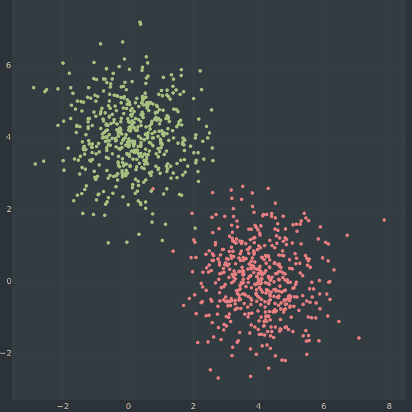
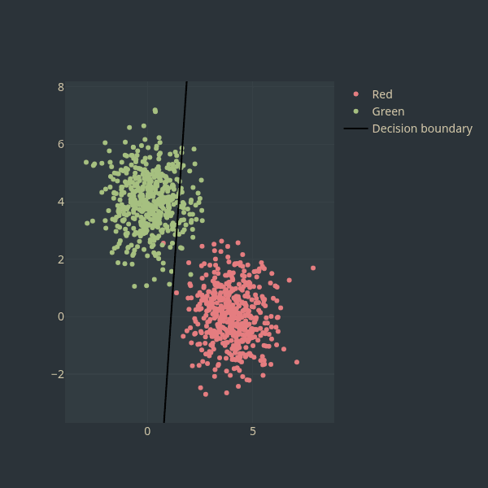
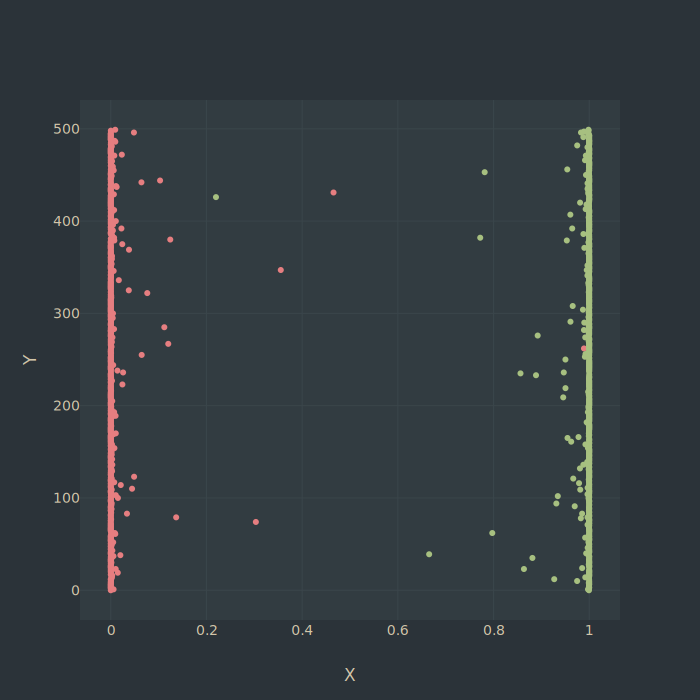
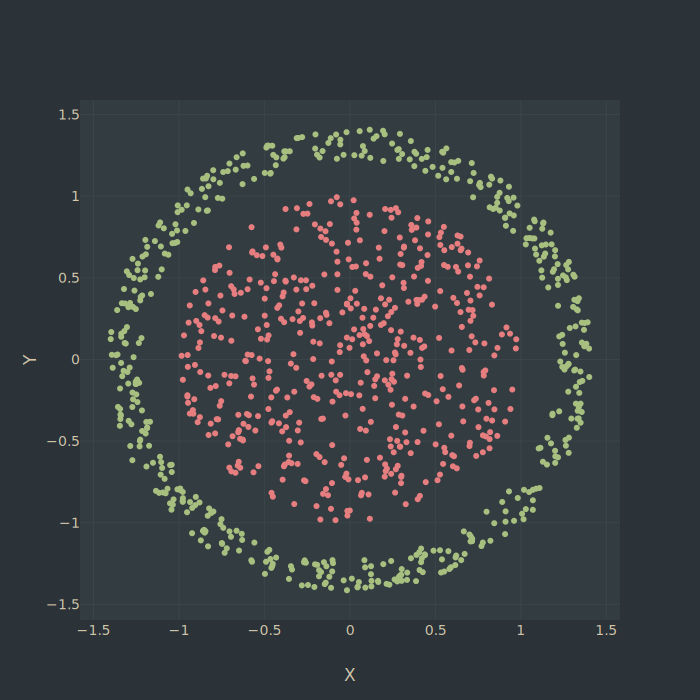
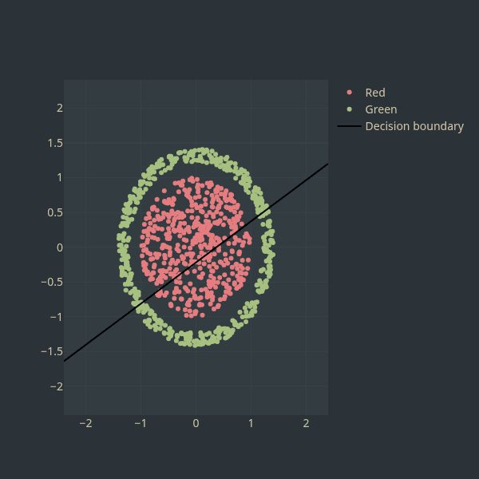

When we are trying to classify our data using deep learning methods, what’s
the point in adding more layers? I find the typical answer is simply that
more layers lets us model more complex functions. This sounds reasonable, but
I found this didn’t really click with me until I started imagining how
multiple layers could actually twist and contort the data to fit our needs
nicely. My goal is to visualize this process so that we can get some more
intuition on why multiple layers are actually necessary. We’ll start as
simple as possible and see how more layers can solve our problems.

## Why Not Just Use One Layer?

Let’s assume our goal today is to classify some data. We have green and red dots
on a 2D plane as shown below. We want to build a model that will tell us how
likely it is, given a spot on the 2D plane, our dot is red or green.



This data is simple, so we actually only need one layer and one neuron in order
to classify these dots. We can see our model below.
```python
class SimpleMLP(nn.Module):
    def __init__(self):
        super().__init__()
        self.layer1 = nn.Linear(2, 1)
        
    def forward(self, x, capture=False):
        out = torch.sigmoid(self.layer1(x))
        return out

model = SimpleMLP()
```
Here all we are doing is a linear model followed by a sigmoid. This is logistic regression, where the line acts as a
decision boundary and the sigmoid maps outputs to probabilities.

Now we just need to train our model. As we train the model, the gradients push points away from the decision boundary.



As we can see, the model learns to make a line pretty easily. This line does a good job of separating our different
dots. As we can see below, the model correctly assigns high probability to green dots and low probability to red dots.



Okay that seemed easy enough. It looks like one layer is all we need. What if we try something harder?



Uh oh, now we have spherical data. This data is not linearly separable, meaning no straight line can divide the classes.
But maybe, just maybe, there are principles outside of our knowledge, mysterious laws and forces that our neuron can use
to magically draw a line to separate the dots?



😔 Sadly, one neuron is not enough. It looks like we should try multiple layers now.

## Trying Multiple Layers

Ok let’s setup our new model. I am going to arbitrarily choose 2 more
hidden layers. However, I am going to choose 3 neurons so that readers
confined to living in 3 dimensions are able to visualize how the data
is represented in between layers using 3D scatter plots. In practice,
architecture choice is problem-dependent, and visualization like this
is rarely possible in high dimensions.
```python
class SimpleMLP(nn.Module):
def __init__(self):
    super().__init__()
    self.layer1 = nn.Linear(2, 3)
    self.layer2 = nn.Linear(3, 3)
    self.layer3 = nn.Linear(3, 1)
    self.relu = nn.ReLU()
    
def forward(self, x, capture=False):
    h1 = self.layer1(x)
    h2 = self.layer2(h1)
    out = torch.sigmoid(self.layer3(h2))
    return out

  model = SimpleMLP()
```
Ok now let’s train the model and see if our model predicts the dots any better now. We’ll see what probability our
model predicts for all the dots.


Hmmm… this doesn’t look very good. It seems like our model isn’t predicting the colour of the dots any better than
chance. Astute readers will recognize that we forgot to add activation
functions between layers.

## Importance Of Activation Functions

If we don’t have activation functions between our layers, our model is unable to do anything more than linear
transformations. That means even though we added more layers, the model is equivalent to a single linear
transformation.

A linear layer has the form $ \mathbf{h} = W\mathbf{x} + \mathbf{b} $.

Without activation functions, stacking linear layers adds no expressive power.

$$
\mathbf{h}_1 = W_1 \mathbf{x} + \mathbf{b}_1
$$

$$
\mathbf{h}_2 = W_2 \mathbf{h}_1 + \mathbf{b}_2
$$

$$
\mathbf{h}_2 = W_2(W_1\mathbf{x} + \mathbf{b}_1) + \mathbf{b}_2
= (W_2W_1)\mathbf{x} + (W_2\mathbf{b}_1 + \mathbf{b}_2)
$$

This is equivalent to a single linear layer.

Linear transformations mean if we take our dots into 3D space, we can only scale and rotate them around in ways that
preserve the linear structure of the space. That means parallel lines need to stay parallel, so we are incapable of
bending or warping the space. No matter how much we rotate or scale our data, we can’t draw a line that separates the
classes.

We can take a look at how the data was projected after the first and second layers.

First layer:
<iframe 
  src="/assets/mlp-visualization/h1_noact.html" 
  width="100%" 
  height="600" 
  style="border:none;">
</iframe>
Second layer:
<iframe 
  src="/assets/mlp-visualization/h2_noact.html" 
  width="100%" 
  height="600" 
  style="border:none;">
</iframe>
No matter how hard our model tried, it couldn’t find a way to cleanly separate the dots with these limitations. It just
always ended up being a 2d circle in 3d space. Try
rotating the camera round yourself to see if you can do any better :).

## Adding The Activation Functions

Ok, now let’s actually add our activation functions so that our model can warp the space, I am going to arbitrarily
choose ReLU functions.

```python
class SimpleMLP(nn.Module):
    def __init__(self):
        super().__init__()
        self.layer1 = nn.Linear(2, 3)
        self.layer2 = nn.Linear(3, 3)
        self.layer3 = nn.Linear(3, 1)
        self.relu = nn.ReLU()
        
    def forward(self, x, capture=False):
        h1 = self.relu(self.layer1(x))
        h2 = self.relu(self.layer2(h1))
        out = torch.sigmoid(self.layer3(h2))
        return out

model = SimpleMLP()
```
Now our model has the power to warp and twist our data in between layers.
Blaise Agüera y Arcas has likened this process to the process of ["kneading
dough", or rather, "unkneading"
dough](https://whatisintelligence.antikythera.org/chapter-04/#unkneading). We
are taking our data/dough, squishing it into balls and flattening it against
the table over and over until it takes a form that suits our needs nicely.

Let’s train our model and visualize how our data gets squished and stretched around in between layers.

Below, we see that after the first layer, the model was able to pull the inside of the circle out further. Now, if you
rotate the camera just right, we can already see a way to cut a line (plane) between the classes.

<iframe 
  src="/assets/mlp-visualization/h1.html" 
  width="100%" 
  height="600" 
  style="border:none;">
</iframe>

Below, we see that after the second layer, it is even easier for the model to disinguish the two colours. They have been
stretched to be grouped together very nicely.

<iframe 
  src="/assets/mlp-visualization/h2.html" 
  width="100%" 
  height="600" 
  style="border:none;">
</iframe>

Now, our final output (which I am unnecessarily showing in 3D), we can see the model confidently gives correct
probabilities for all the dots.

<iframe 
  src="/assets/mlp-visualization/output.html" 
  width="100%" 
  height="600" 
  style="border:none;">
</iframe>

It looks like we are finally able to predict our dots nicely thanks to using more layers! As a side note, after training
the model a few times, I did not always get perfect accuracy we see here and got some other interesting shapes that did
not perform as well.

## Can We Use Fewer Layers?

One thing I noticed while making visualization is that it seems like we can already draw a line between dots after the
first hidden layer. So surely, we can just remove a layer? Sure enough, we can. Looking below we can see how the model
does perfectly fine with just one hidden layer.

We see below, the 1 hidden layer model reproduces the same behaviour as the two layer model earlier.

<iframe 
  src="/assets/mlp-visualization/h1_1layer.html" 
  width="100%" 
  height="600" 
  style="border:none;">
</iframe>

As well, the final output gets the majority of the predictions correct, although the red and green dots are not as well
separated, so we are not as confident in this model as before.

<iframe 
  src="/assets/mlp-visualization/output_1layer.html" 
  width="100%" 
  height="600" 
  style="border:none;">
</iframe>

It is interesting how if we visualize in 3D space it’s easy to realize when we can definitely use less layers, but with
high-dimensional data and many layers, this is most certainly not the case.

## Conclusion

Hopefully this post gave some concrete reasoning on why we might need more layers to solve more complex problems in deep
learning. This is certainly not the whole story, but I hope it provides a little bit more intuition on the topic.

## Further Reading

Some related posts I found while making this:

- [Karpathy has a similar 2D visualization](https://cs.stanford.edu/people/karpathy/convnetjs/demo/classify2d.html)
- [Tensorflow has made a more fully featured 2D simulator](https://playground.tensorflow.org/#activation=tanh&batchSize=10&dataset=circle&regDataset=reg-plane&learningRate=0.03&regularizationRate=0&noise=0&networkShape=3,3&seed=0.77559&showTestData=false&discretize=false&percTrainData=50&x=true&y=true&xTimesY=false&xSquared=false&ySquared=false&cosX=false&sinX=false&cosY=false&sinY=false&collectStats=false&problem=classification&initZero=false&hideText=false&resetButton_hide=false)
- [Chris Olah talks about similar concepts in much more depth](https://colah.github.io/posts/2014-03-NN-Manifolds-Topology/)
