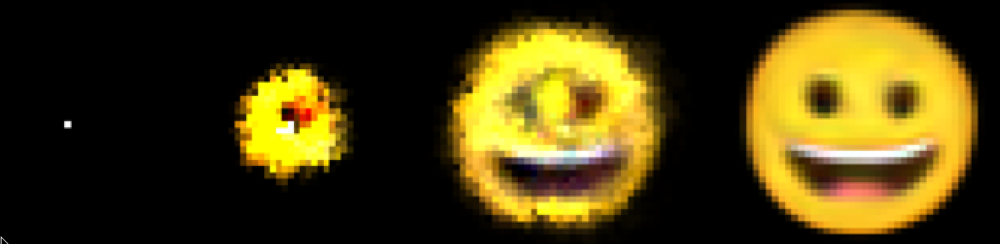
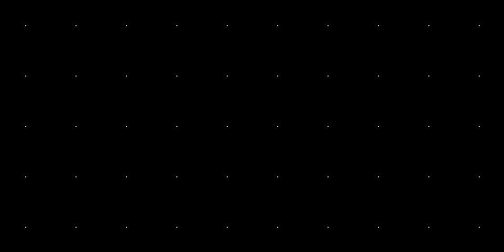
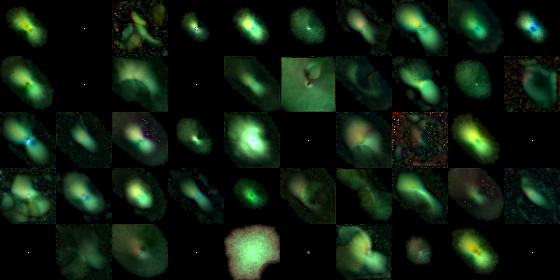
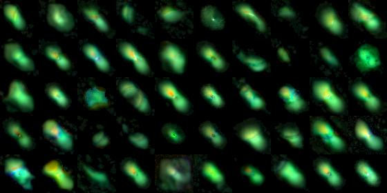
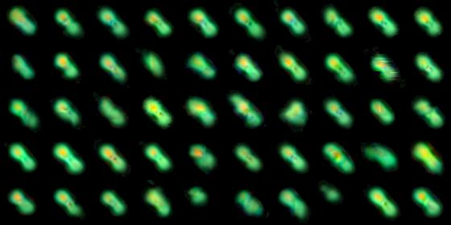

I first found out about Neural Cellular Automata through this [article by
Distill](https://distill.pub/2020/growing-ca/). It it an excellent article so
you should definitely go read it first. In fact, this post is mostly just an
attempt to recreate their results but with PyTorch instead of TensorFlow. I'm
making this article mostly for my own sake, but read on if you want a shorter
summary and a little bit of my own perspective.

## What are neural cellular automata?

In case you don’t know, cellular automata are a model of computation where we
typically have a regular 2D grid of cells and where each cell has a specific
state, like on or off. On top of that, we have some rules for how the states
change, such as if my neighbor is on then I turn on too. A simple ruleset can
make some super interesting and complex patterns like Conway's game of life
below.


Or Stephen Wolfram's Rule 30.


Neural cellular automata are the exact same concept, but instead of having
specific programmed rules, we can treat each cell like a little deep learning
model that we can train. Each cell has the exact same trained weights and they
all perform the same calculations. Despite performing the same calculation,
each cell will start off with a different state and different neighbors so lots
more interesting stuff can happen.

Neural cellular automata are interesting because now we don’t have to predefine
the rules. Instead, we can just train the model to generate the weights that
will give us the behaviour we want. This allows us to make cellular automata
systems that would otherwise be very difficult to setup analytically. For
example, training all the little cells to work together to make a lizard or
happy face despite only knowing about their current surroundings. That’s what
we are going to do now!

## Recreating growing neural cellular automata

I am going to try to be brief here because you can just read the incredible
article itself, which even has a fun interactive demo to go with it. The goal
of the model is to feed in a single seed, a 1x1 cell, and have it grow into our
target image, such as a smiley face or microbe.



For our system, each cell has 16 independent states/channels. 4 for red, green,
blue, and alpha channels, which are the channels that we see and use to
calculate our loss with by comparing to the target image. The remaining 12
states are hidden and left up to the cells to decide how to use.

Every cycle, each cell senses only the 3x3 cells around it (as well as itself).
In the article, this entails two sobel filters and an identity matrix. For my
model, I added an additional laplace filter. These filters are just like
kernels as in a convolutional neural network. So for each cycle, each cell
senses using 4 filters for each of the 16 channels, resulting in 4*16=64 total
inputs to each cell.
```python
def perception(x):
    device = x.device

    identity = torch.tensor([[0,0,0],[0,1,0],[0,0,0]], dtype=torch.float32)
    sobel_x  = torch.tensor([[-1,0,1],[-2,0,2],[-1,0,1]], dtype=torch.float32)/8.0
    sobel_y  = sobel_x.T
    laplace  = torch.tensor([[0,1,0],[1,-4,1],[0,1,0]], dtype=torch.float32)/8.0

    kernels = torch.stack([identity, sobel_x, sobel_y, laplace])
    kernels = kernels[:, None, :, :].to(device)

    kernels = kernels.repeat(C, 1, 1, 1)

    return F.conv2d(x, kernels, padding=1, groups=C)
```
In addition, we only sense the surrounding cells if they are alive. If the cell
has alpha of 0.1 or more, then it is alive. Only alive cells can do anything
and if they are alive, they cause the cells around them to be “growing”. The
“growing cells” don’t cause the cells beside them to be alive.

Now, the actual trained parameters are just a feed-forward neural network with
a 128-neuron hidden layer. Therefore, each cell takes in 64 inputs, transforms
to 128-neuron hidden state, and then finally needs to output its new state,
which is once again 16 channels. This leads to 64 * 128 + 128 * 16 = 10240
trainable parameters.


Here is our code for the model. It is surprisingly simple given the complex task.
```python
class NCA(nn.Module):
    def __init__(self, channels=C, hidden=128):
        super().__init__()
        self.net = nn.Sequential(
            nn.Conv2d(channels * 4, hidden, 1),
            nn.ReLU(),
            nn.Conv2d(hidden, channels, 1, bias=False)
        )

        nn.init.zeros_(self.net[-1].weight)

    def forward(self, x, fire_rate=0.5):
        y = perception(x)
        dx = self.net(y)

        # stochastic update mask
        update_mask = (torch.rand_like(x[:, :1]) <= fire_rate).float()
        x = x + dx * update_mask
        x = x * alive_mask(x)
        return x
```
*Note: we could have made the filters/kernels trainable parameters to allow the
model to decide what to sense, but the original article just used fixed
filters, so I’m following same method. Also makes things simpler!*

### Training the model

Now, to train the model, we just start with a single seed and let it update
around 70 steps. After that, we calculate the loss (how close it was to the
target image) then we backpropagate through time as in a RNN. We update the
weights accordingly and continue this process until our model successfully
grows from seed to target image. We can see the output below!


This works surprisingly well, except the problem is that we only trained our
model to *just reach* the target state and not maintain it. Therefore, in most
cases, after we reach our 70 steps, our model has never been trained to go
beyond this point, so it doesn't know what to do after reaching the target, and
it just falls apart...


### Maintaing form with pooling

In order to get our model to keep its form, we need to train it to start off
with something close to the target image and keep it there. We do this by using a
pool of starting samples instead of just always starting from a single seed.

First, we create a pool full of just single seeds. We pipe those samples into
the model and then we take whatever the model outputs and throw it back into
the pool. Now the model has a chance to grab a sample from the pool that is at
least a little more than a single seed. As the model gets better, the pool will
mostly just be full of samples very close to the target image, so the model now
has the goal of maintaining that target image for about 70 steps.

We also ensure that at least one sample in the batch is just a single seed so
that we never forget how to grow from a single seed. 

Look at how the pool starts off with just seeds, but gradually gets filled up
with samples that are closer and closer to the target image.






With that implemented, we retrain our model and see that it does a much better
job of maintaining itself.


### Regenerating

The article goes one step further and tests to see if the model can regenerate
itself if part of it is damaged, similar to a reptile that can regrow a tail
when it is cut off.


We can train our model to do this by just repeatedly punchings holes in our
samples.


We make holes in some of the input samples so that the model is forced to learn
how to regrow to the target from various damaged states. As you can see below,
we just damage a few of the samples, in this case, just the last 3 of the
batch.


This works quite well. Even when slicing it in half (something we didn't even
train for), the cells are all still able to work together to return to the
target state.


Also note, the microbe is a lot less detailed than before. It is missing the
noodles that were previously sticking out of it. After implementing damage, the
model struggled to learn to both be able to regenerate from different
damaged positions as well as create a very accuracte reproduction of the target
image. I assume if I added more parameters and training time this could be
resolved, but I didn't want to wait any longer for training models 😛. 

## What did I learn?

Since this post is mostly for my own sake, I'm just going to go over the big
things that I've learned from working on this project.

### Building cellular automata is easy to get into

I've never messed with any cellular automata before this and I was surprised at
how easy it was. I was worried about how to render the pixels and manage the
state and things, but in reality you can just make a big numpy array, play with
it as you want, and then display with matplotlib using a single line of code.

In addition, despite there not being any specific built-in functions in PyTorch
for NCA, everything was very straightforward. I was able to just use the
functions typically used for CNN's and RNN's to do convolutions and backprop
through time with ease. I just had to treat all of the cells as a 1x1
convolution, so I got a system that was simple as well as performant thanks to
being able to use all of PyTorch's optimizations. Training a model never took
much more than 5-10 minutes on Google Colab.

### More "complex" images can be easier to learn

I mentioned briefly earlier that I struggled to get the microbe image to
regenerate *and* accurately reproduce the target image. I spent a good
amount of time trying to fix this problem. I had briefly tried using more
layers in the feed-forward neural network, but it didn't seem to fix my
problem. I also found a few small errors in my code that might have been
contributing to the issue.

I eventually later tried the exact same model that was failing to accurately
repoduce the microbe emoji, except on the lizard emoji.


First of all, qualitatively the lizard already seems more accurate compared to
the microbe and has more detail. In addition, even after slicing it in half and
blowing a big hole in it, the lizard regenerates really well. The lizard seems
so much more complex than the simple microbe which is just a blob. Despite
this, the NCA seems to perform much better with the lizard. What's going on?

My guess is that the NCA are just better at learning local structure, and with
the lizard this is more apparent. There is a centre spot in the body which is
more yellow and has some dotted pattern on the back. If you just took a small
random 5x5 snippet of the image, I think you'd have a better chance of guessing
where you are compared to the microbe. With a microbe, there is just a lot of
solid green without much variation or edges. This may make it harder to learn.

This is just a guess and I'm sure there are some interesting experiments I
could do in the future to better validate this by trying to grow different
images with different levels of complexity or local structure.

In fact, I was trying to design some of my own lizards and trying out different
ways of encoding structure into the image itself to hopefully help the NCA to
learn. I thought of things like colour-coding repeating structures or building
using more circles or simple patterns, but I ultimately decided to postpone
this for some other time. Here are some of the lizards I drew though😅.


### Normalizing is important

Maybe this is just me, but normalization never feels that important whenever I
am reading about deep learning. It always seems just tacked on as something
that might slightly increase performance, and for that reason, I typically
forget about it. However, in this project I definitely realized its importance.

One of the big things that helped me improve the model to help generate the
microbe better was normalizing gradients and normalizing convolutions. I guess
I missed this when implementing my model because it is subtle and not mentioned
explicitly except in the footnotes of the original article.

Normalization makes a lot of sense here because for each iteration we are
recursively updating the output up to almost 100 steps. That means we are
backpropagating through time 100 steps, so if there are gradients or
convolutions above 1, then gradients will explode. I experienced this with lots
of fluctuations in the loss while training and after normalization, training
always seemed qualitatively smoother and I was able to better reduce loss.
Seems like with NCA, it's better to take our time with slower training and take
little steps considering how big steps can quickly take us off course. 

## Conclusion

NCA are very cool and I plan on doing some more experimentation with this
system in the future. My original idea was maybe to try and find out a little
bit about what the NCA are actually doing when they build the target image, but
I found I already had a good amount here to display just from recreating the
system from the article. Hopefully I make some more posts in the future where I
try to more of my own thing!
